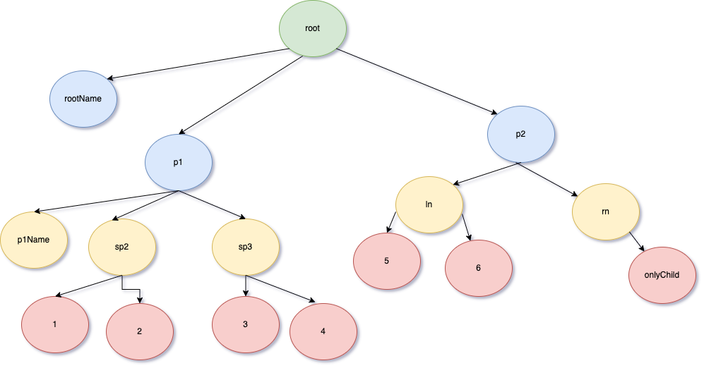

# Backend engineer challenge
This branch in the repository contains an assignment for Backend roles at Cyber Sierra


## Assignment 1:

### Q1> Write a function to convert the following dictionary to a tree:

For this challenge you can use any graph library like networkx or graphviz or zefhub

{
'root': [ 
	'rootName',
	{'p1': [ 'p1Name',
					{
					 'sp2': [1, 2], 
					 'sp3': [3,4]
					}
				]
	},
	{
		'p2': {'ln': [5,6], 
					 'rn': 'onlyChild'
					 }
	}
]
}


#### Expected Tree:




#### Test inputs to pass: 

a. Pass subtrees as dictionary
```json
{
'root': [ 
	{
		'p2': {'ln': [5,6], 
			   'rn': 'onlyChild'
					 }
	},
	{  'p3': {'ln2': 'leftChild',
			  'rn2': 'rightChild'}}
]
}
```

b.  Pass subtrees  List
```json
{
'root': [ 1,
          {'secondParent': [2,3]}, 
          4
]
}
```


c. Pass subtrees as str + List[Dict]
```json
{
'root': [ 
	'rootName',
  {  'p1': 'p1Name'
	 'sp2': [1, 2], 
	 'sp3': [3,4]
	}
  ]
}
```

d. Bonus: Pass subtrees as Dict:
```json
{

"root":  { "p2": { "ln": [5,6],
           	   "rn": "onlyChild"},
           "p3": {"ln2": "leftChild", 
                    "rn2": "rightChild"}
        }
}
```


Q2> From the tree in Q1,

a. Return the bottom-up level order traversal of its nodes’ values. (ie, from left to right, level by level from leaf to root).

Expected Output:
```
[[1,2,3,4,5,6,'onlyChild'], ['p1Name', 'sp2', 'sp3', 'ln', 'rn'], ['rootName', 'p1', 'p2']]
```

b. Take input from a user to skip a level and skip that level
